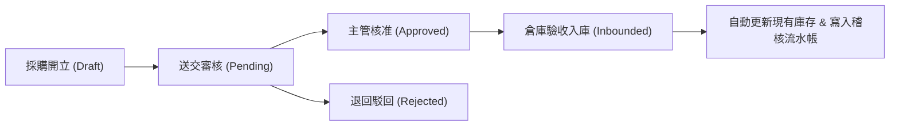
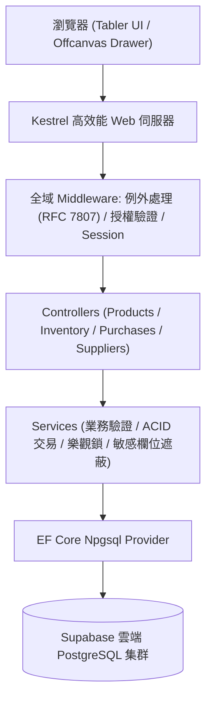

# 📦 WebAPICore - 雲端現代化進銷存與倉儲管理系統 (ERP)

[](https://dotnet.microsoft.com/)
[](https://supabase.com/)
[](https://preview.tabler.io)
[](https://scalar.com/)
[](https://xunit.net/)
[](https://www.docker.com/)

一個遵循 **Clean Architecture**、**RESTful API 規範**、**ACID 資料庫交易保證**、**RBAC 權限角色隔離** 與 **Single-Page Experience (Modal & Drawer SPA)** 的企業級進銷存管理系統。整合 **Supabase 雲端 PostgreSQL**，具備並發防超賣樂觀鎖、兩層級導覽選單、全寬大表與右側專注填表抽屜面板。

---

## 🌐 線上即時展示 (Live Showcase)

- 🚀 **SaaS 營運管理系統儀表板**：👉 [https://webapicore.onrender.com/](https://webapicore.onrender.com/)
- 📚 **Scalar 現代化 API 互動文件**：👉 [https://webapicore.onrender.com/scalar/v1](https://webapicore.onrender.com/scalar/v1)
- 🗄️ **託管資料庫**：Supabase PostgreSQL（具備連線池與 SSL 加密防護）

---

## 👥 角色權限矩陣 (RBAC & RLS)

本系統具備嚴格的 **角色型存取控制 (RBAC)** 與 **部門資料列級隔離 (Row-Level Security / RLS)**，倉管員自動遮蔽機密進價成本：

| 角色 | 預設帳號 / 密碼 | 角色職責與權限範圍 | 特殊資料隱私規則 |
| :--- | :--- | :--- | :--- |
| 👑 **Admin** | `admin` / `Admin888!` | 系統全域管理員，具備所有資料新增、修改、刪除、審核與使用者帳號配置權限。 | 無限制，可跨部門調閱全單據。 |
| 👔 **Manager** | `manager` / `Manager888!` | 營運主管，可檢視全公司庫存、審核採購單（核准/駁回）、維護供應商與商品。 | 可查閱進價成本與完整財務明細。 |
| 👤 **Purchaser** | `purchaser` / `Buyer888!` | 採購專員，可開立採購單、新增/編輯供應商主檔、發起補貨申請。 | **部門列級隔離**：僅能檢視採購部門之採購單。 |
| 👷 **Warehouse** | `warehouse` / `Worker888!` | 倉庫管理員，負責庫存盤點、入庫驗收入帳、銷貨出庫扣減。 | 🔒 **機密遮蔽**：進價成本自動遮蔽為 `***`，杜絕成本洩漏。 |

---

## 🌟 核心架構與功能亮點

### 1. 現代化單頁體驗 UI (Tabler + Offcanvas Drawer SPA)
- **兩層級導覽選單**：支援手風琴折疊、一鍵收折側邊欄擴充工作區。
- **全寬模組大表**：商品清單、低庫存警戒、採購單總覽、供應商主檔、使用者權限清單置頂全寬展開。
- **右側專注填表抽屜 (Drawer Panel)**：新增採購、盤點審批、廠商維護皆在右側滑出抽屜中非同步 (AJAX) 完成，杜絕頁面跳轉。
- **無閃爍深淺切換 (Instant Dark Mode)**：支援日光/暗黑主題一秒切換。

### 2. 嚴謹的進銷存審批生命週期 (Procurement & Audit)


### 3. ACID 資料庫交易與稽核流水帳 (Audit Ledger)
- 任何進貨入庫（Inbound）與銷貨出庫（Outbound），均透過 EF Core `BeginTransactionAsync()` 執行。
- 保證「庫存數值異動」與「不可竄改的流水帳記錄（StockMovements）」同生共死。

### 4. 高並發防超賣機制 (Race Condition Protection)
- **資料庫層級約制**：PostgreSQL `CHECK ("CurrentQty" >= 0)` 約束，物理層杜絕負數庫存。
- **樂觀鎖並發防禦**：以 PostgreSQL 隱藏欄位 `xmin` 作為版本 Token，並發衝突時拋出例外並防禦。

---

## 🏛️ 系統端到端請求架構圖



---

## 🚀 本地快速啟動

### 方式一：使用一鍵啟動腳本（Windows）
在專案根目錄執行：
```powershell
.\start.bat
```
*(腳本會自動編譯啟動，並在預設瀏覽器中開啟系統首頁)*

### 方式二：使用 .NET CLI
```bash
# 還原套件並啟動專案
dotnet run --project WebAPICore.Api --urls "http://localhost:5092"
```

啟動後請訪問：
- 🌐 **SaaS 營運管理儀表板**：`http://localhost:5092/`
- 📚 **Scalar 現代化 API 互動文件**：`http://localhost:5092/scalar/v1`

---

## 📡 核心 API 端點規格

| 模組 | HTTP | 端點路徑 | 說明與存取控制 |
| :--- | :--- | :--- | :--- |
| **商品管理** | `GET` | `/api/v1/products` | 查詢商品清單（支援分類、搜尋與分頁） |
| | `POST` | `/api/v1/products` | 建立新商品（SKU 唯一性檢核、初始化 0 庫存） |
| **庫存作業** | `POST` | `/api/v1/inventory/inbound` | 進貨入庫（ACID 交易並發記帳） |
| | `POST` | `/api/v1/inventory/outbound` | 銷貨出庫（**樂觀鎖防超賣保護**） |
| | `GET` | `/api/v1/inventory/low-stock` | 低於安全庫存預警清單 |
| | `GET` | `/api/v1/inventory/{id}/movements` | 調閱商品歷史對帳流水帳 |
| **採購單據** | `GET` | `/api/v1/purchases` | 採購單清單（支援部門資料隔離 RLS） |
| | `POST` | `/api/v1/purchases` | 開立新採購單 |
| | `PUT` | `/api/v1/purchases/{id}/approve` | 主管審批採購單（核准/駁回） |
| **供應商主檔** | `GET` | `/api/v1/suppliers` | 供應商名冊與聯絡人資訊 |
| | `POST` | `/api/v1/suppliers` | 建立或維護供應商主檔 |

---

## 🧪 品質驗證與自動化測試

本專案堅持測試驅動與高品質交付，包含完整的單元測試與端對端測試：

1. **xUnit 單元與整合測試 (49/49 Passed)**：
   ```bash
   dotnet test
   ```
   涵蓋樂觀鎖並發衝突、負庫存防禦、採購單審核生命週期、部門 RLS 隔離與進價遮蔽驗證。
2. **Playwright E2E 自動化測試**：
   模擬真實瀏覽器環境，針對登入身份切換、兩層級選單展開/收折、抽屜面板填表與即時數據刷新進行全流程覆蓋驗證。

---

## ☁️ 雲端容器化部署 (Render)

本專案包含生產級多階段 `Dockerfile`，支援一鍵部署至 Render：

1. 將專案 Push 至 GitHub。
2. 登入 [Render Dashboard](https://dashboard.render.com/)，點選 **New +** ➜ **Web Service**。
3. 連結此 GitHub 儲存庫，**Environment** 選擇 **Docker**。
4. 設定環境變數：
   - `ConnectionStrings__DefaultConnection` = `<您的 Supabase PostgreSQL 連線字串>`
5. 點擊 **Deploy**，幾分鐘內即可完成雲端上線！
