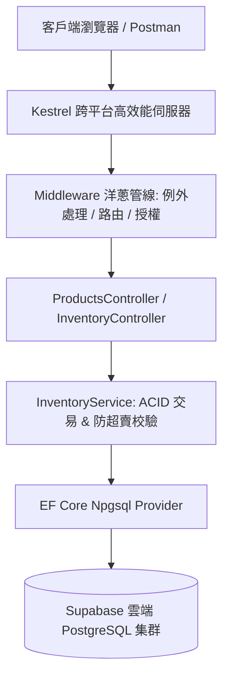

# 📦 WebAPICore - 雲端現代化進銷存與倉儲管理系統 (ERP)

[](https://dotnet.microsoft.com/)
[](https://supabase.com/)
[](https://preview.tabler.io)
[](https://scalar.com/)
[](https://www.docker.com/)

一個遵循 **Clean Code**、**RESTful 規範**、**ACID 資料庫交易保證** 與 **Modal-First SPA CRUD** 架構的高效能企業級進銷存管理系統。串接 **Supabase 雲端 PostgreSQL** 資料庫，具備並發防超賣樂觀鎖防護與現代化 **Tabler SaaS 營運儀表板**。

## 🌐 線上即時展示 (Live Showcase)
- 🚀 **SaaS 營運管理儀表板**：👉 [https://webapicore.onrender.com/](https://webapicore.onrender.com/)
- 📚 **Scalar 現代化 API 互動文件**：👉 [https://webapicore.onrender.com/scalar/v1](https://webapicore.onrender.com/scalar/v1)
- 🗄️ **託管資料庫**：Supabase PostgreSQL（具備 Connection Pooler 與 SSL 強制加密）

---

## 🌟 核心架構與技術亮點

1. **ACID 資料庫交易與稽核流水帳（Audit Ledger）**：
   - 任何進貨入庫（Inbound）與銷貨出庫（Outbound），均透過 EF Core `BeginTransactionAsync()` 執行。
   - 保證「庫存數值異動」與「不可竄改的流水帳記錄（StockMovements）」同生共死，落實財務級別的帳實相符。

2. **高並發防超賣機制（Race Condition Protection）**：
   - **底層保證**：PostgreSQL 資料庫層級建立 `CHECK ("CurrentQty" >= 0)` 約束，杜絕負數庫存。
   - **應用層保護**：整合 PostgreSQL 原生 `xmin` 系統隱藏欄位作為 EF Core 樂觀鎖版本 Token，並發衝突時拋出例外並防禦。

3. **統一錯誤格式（RFC 7807 ProblemDetails）**：
   - 全域 Middleware Pipeline 捕捉未預期例外，統一封裝為標準 RFC 7807 格式，避免伺服器敏感堆疊外洩。

4. **現代化 Tabler SaaS 前端儀表板**：
   - **4 欄式 KPI 營運指標卡**：即時掌握商品品項數、總庫存量、低庫存警戒品項。
   - **防閃爍 (No FOUC) 深淺主題**：亮色 / 暗黑模式一秒平滑切換。
   - **Modal-First SPA CRUD**：新增商品與出入庫操作皆於磨砂彈窗內非同步完成，零頁面跳轉。

---

## 🏛️ 系統端到端請求架構圖



---

## 🚀 本地快速啟動

### 方式一：使用一鍵啟動腳本（Windows）
在專案根目錄執行：
```powershell
.\start.bat
```
*(腳本會自動編譯啟動，並在預設瀏覽器中開啟系統首頁)*

### 方式二：使用 .NET CLI
```bash
# 還原依賴並執行 Web API
dotnet run --project WebAPICore.Api
```

啟動後請訪問：
- 🌐 **SaaS 營運管理儀表板**：`http://localhost:5092/`
- 📚 **Scalar 現代化 API 互動文件**：`http://localhost:5092/scalar/v1`

---

## 📡 核心 API 端點規格

| HTTP 方法 | 端點路徑 | 說明 | 關鍵特性 |
| :--- | :--- | :--- | :--- |
| `GET` | `/api/v1/products` | 查詢商品清單 | 支援關鍵字搜尋、分類過濾與分頁 |
| `GET` | `/api/v1/products/{id}` | 查詢單一商品與即時庫存 | 包含 `isLowStock` 安全庫存預警標籤 |
| `POST` | `/api/v1/products` | 建立新商品 | SKU 唯一性防重複校驗、自動初始化 0 庫存 |
| `POST` | `/api/v1/inventory/inbound` | 進貨入庫作業 | 增加現有庫存、寫入入庫流水帳（ACID 交易） |
| `POST` | `/api/v1/inventory/outbound` | 銷貨出庫作業 | **防超賣檢驗**、樂觀鎖並發防護、扣減庫存並記帳 |
| `GET` | `/api/v1/inventory/low-stock` | 查詢低於安全庫存商品 | 輔助採購即時補貨 |
| `GET` | `/api/v1/inventory/{id}/movements` | 查詢某商品歷史對帳流水帳 | 依時間降冪排列的不可竄改記錄 |

---

## ☁️ 雲端容器化部署 (Render)

本專案內建生產等級的多階段建置 `Dockerfile`，可一鍵無痛部署至 Render 免費 Web Service：

1. 將本專案 Push 至您的 GitHub 儲存庫。
2. 登入 [Render Dashboard](https://dashboard.render.com/)，點擊 **New +** ➜ **Web Service**。
3. 連結您的 GitHub 專案。
4. **Environment** 選擇 **Docker**。
5. 在 **Environment Variables** 新增：
   - `ConnectionStrings__DefaultConnection` = `<您的 Supabase PostgreSQL 連線字串>`
6. 點擊 **Deploy Web Service**，Render 將全自動在雲端完成映像檔建置並配置 HTTPS 網址！
